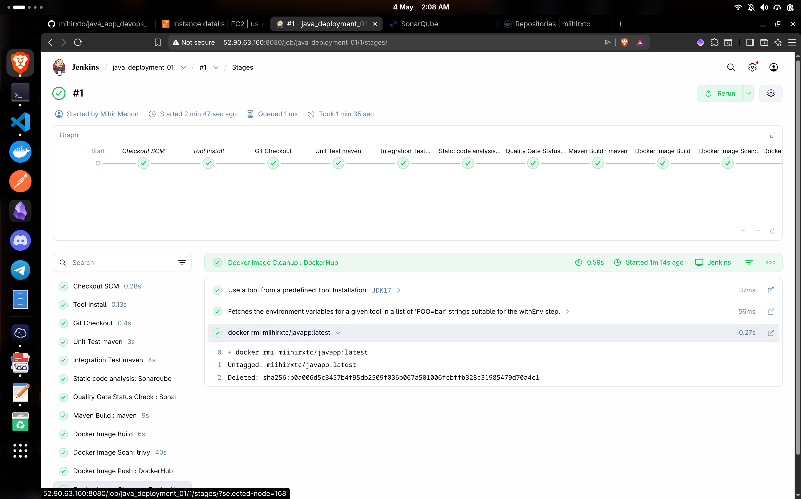
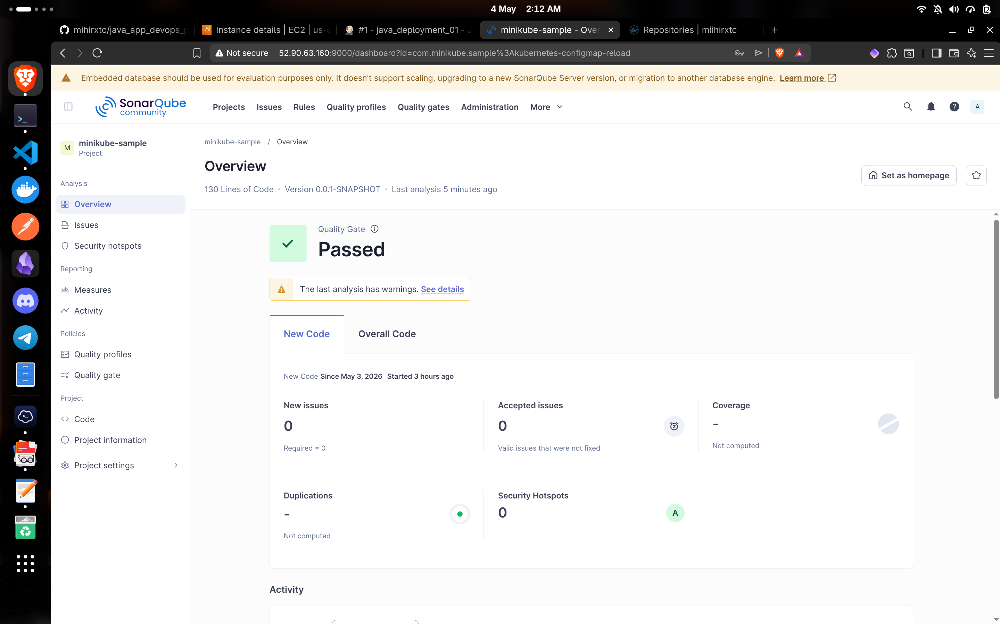
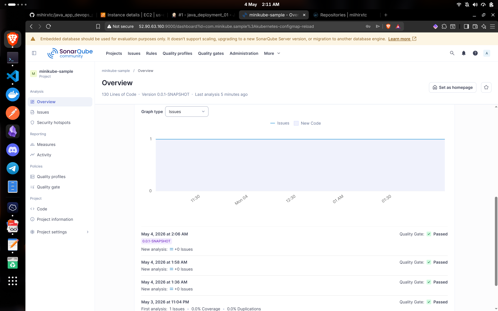
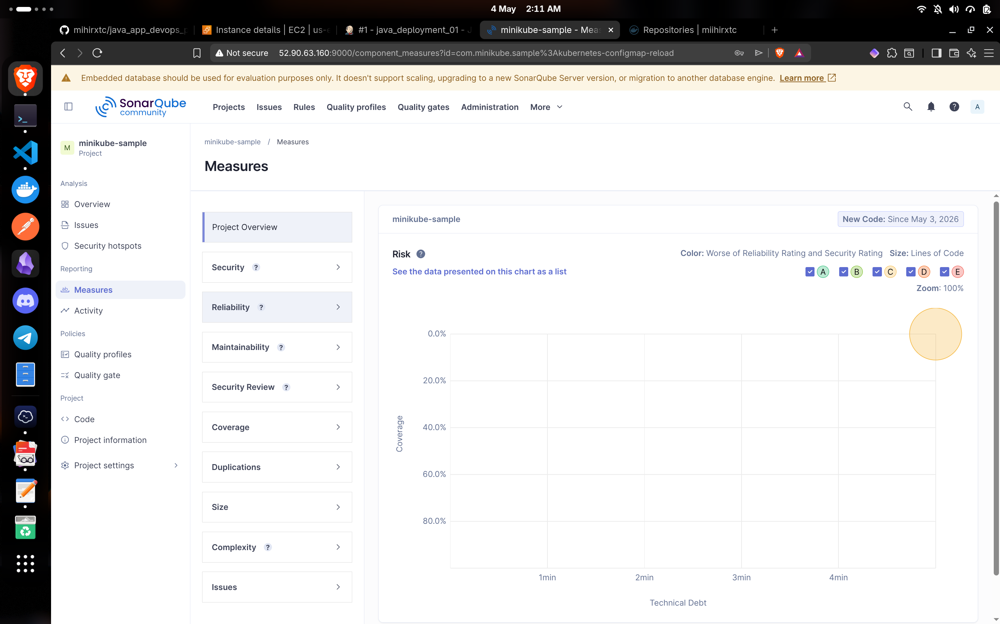
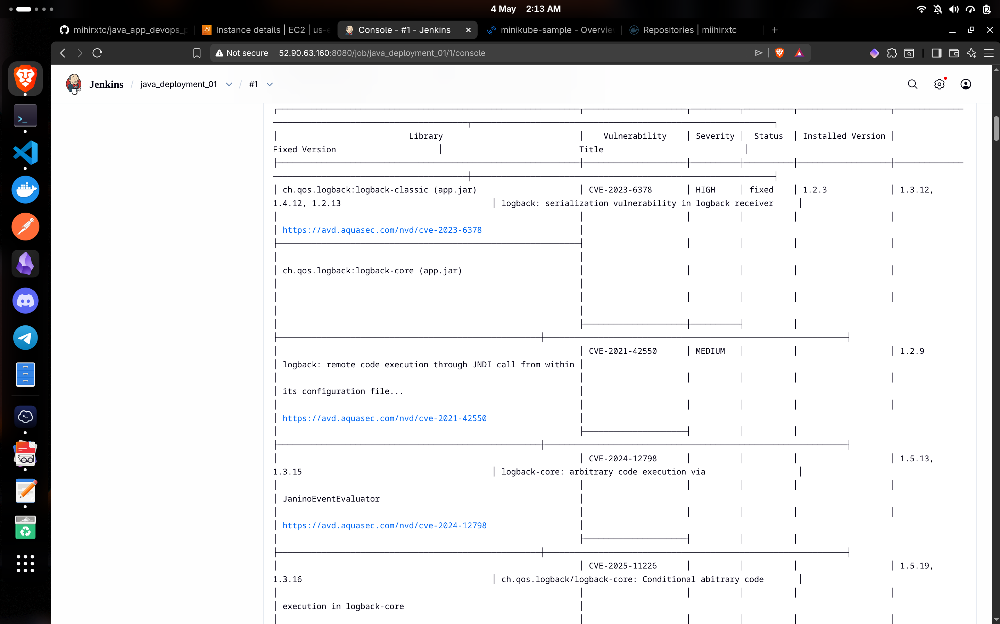
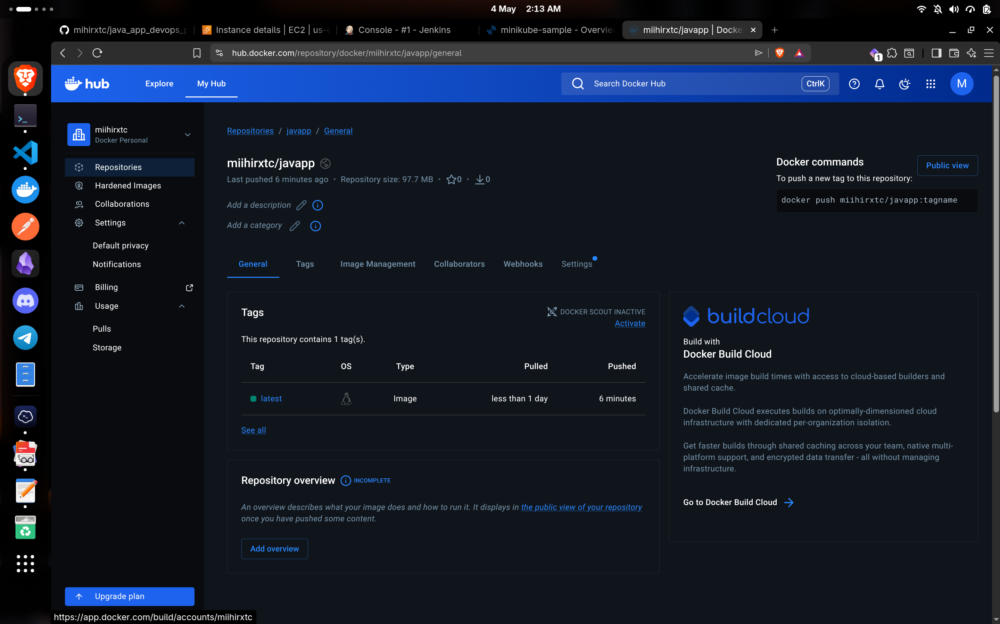
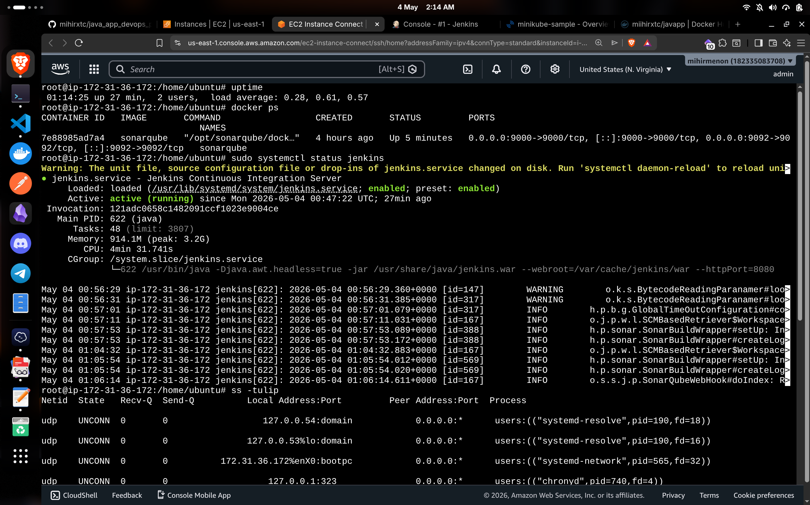

# CI Pipeline — Jenkins · SonarQube · Docker · Trivy · AWS

A production-style Continuous Integration pipeline for a Java application, deployed on AWS EC2. Automates build, test, code quality enforcement, container security scanning, and image publishing on every commit.

---

## Pipeline Flow

```
Git Checkout → Unit Test → Integration Test → SonarQube Analysis
→ Quality Gate → Maven Build → Docker Build → Trivy Scan → DockerHub Push
```

The pipeline **halts at the Quality Gate** if code does not meet defined standards — nothing proceeds to Docker until analysis passes.

---

## Tech Stack

| Layer | Tools |
|---|---|
| CI Orchestration | Jenkins (Declarative Pipeline), Jenkins Shared Library |
| Build & Test | Maven |
| Code Quality | SonarQube, Quality Gates |
| Containerisation | Docker |
| Security Scanning | Trivy |
| Infrastructure | AWS EC2 — Ubuntu 22.04, t2.medium, 30GB EBS |
| Registry | DockerHub |
| Plugins | JFrog Artifactory, SonarQube Scanner |

---

## Infrastructure

```
Cloud:   AWS EC2 — us-east-1
AMI:     Ubuntu Server 22.04 LTS (64-bit)
Type:    t2.medium (2 vCPU · 4GB RAM)
Storage: 30GB EBS
Ports:   8080 (Jenkins) · 9000 (SonarQube) · 22 (SSH)
```

---

## Pipeline Stages

| Stage | Purpose |
|---|---|
| Git Checkout | Pull latest source from GitHub via SCM |
| Unit Test | Validate individual components with Maven |
| Integration Test | Verify service-level behaviour |
| SonarQube Analysis | Scan for bugs, vulnerabilities, and code smells |
| Quality Gate | Block pipeline if quality thresholds not met |
| Maven Build | Package application as `.jar` artifact |
| Docker Build | Build container image from artifact |
| Trivy Scan | Detect CVEs in image before publication |
| DockerHub Push | Publish verified image to registry |
| Cleanup | Remove local image to free EC2 disk space |

---

## Key Results

- **Zero bugs · Zero vulnerabilities** — SonarQube Quality Gate passed on final run
- **End-to-end pipeline completes in under 2 minutes**
- Container CVEs identified and resolved before any image reached DockerHub
- Reusable pipeline logic implemented via Jenkins Shared Library

---

## Jenkins Configuration

**Credentials stored securely in Jenkins:**
- `sonarqube-api` — SonarQube authentication token (Secret Text)
- `docker` — DockerHub username and password

**SonarQube webhook** registered to `http://<EC2_IP>:8080/sonarqube-webhook/` for Quality Gate callbacks.

**Global Pipeline Library:** `my-shared-library` sourced from `github.com/praveen1994dec/jenkins_shared_lib` (branch: `main`).

---

## Screenshots

### Jenkins Pipeline — All Stages Passed


### SonarQube — Quality Gate Passed


### SonarQube — Overview


### SonarQube — Measure


### Trivy — Container Vulnerability Scan Output


### DockerHub — Image Published


### AWS EC2 — Running Instance


---

## Author

**mihirxtc**